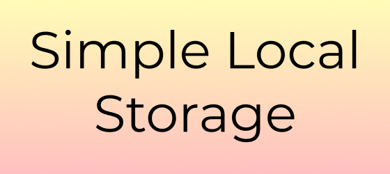
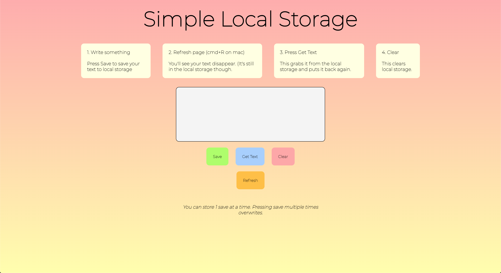

*A simple site that demonstrates the basics of Local Storage.*

[Link to website](http://simplelc.surge.sh/)

### Created by

- Karl Gunnarsson (<https://github.com/KG416>)

### Motivation

I made this when I was learining about Local Storage. Initially just for my myself but if someone else can benefit from this then that's great!

### Features

Simple demonstration of:

- How to save to Local Storage (setItem())
- How to get something from Local Storage (getItem())
- How to clear Local Storage (clear())

### Screenshots

