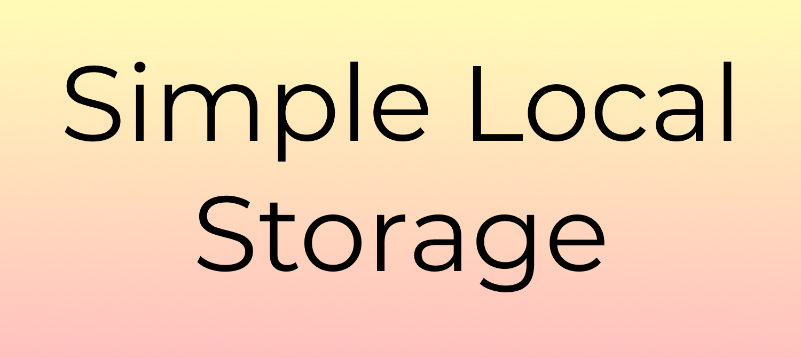

*A simple site that demonstrates the basics of Local Storage.*

### Created by

- Karl Gunnarsson (<https://github.com/KG416>)

### Motivation

I made this when I was learining about Local Storage. Partially for my own sake but hopefully someone
else can benefit from this the same way I do when I have to remind myself of how Local Storage works.

### Features

Simple demonstration of:

- How to save to Local Storage (getItem())
- How to get something from Local Storage (setItem())
- How to clear Local Storage (clear())

### Screenshots

